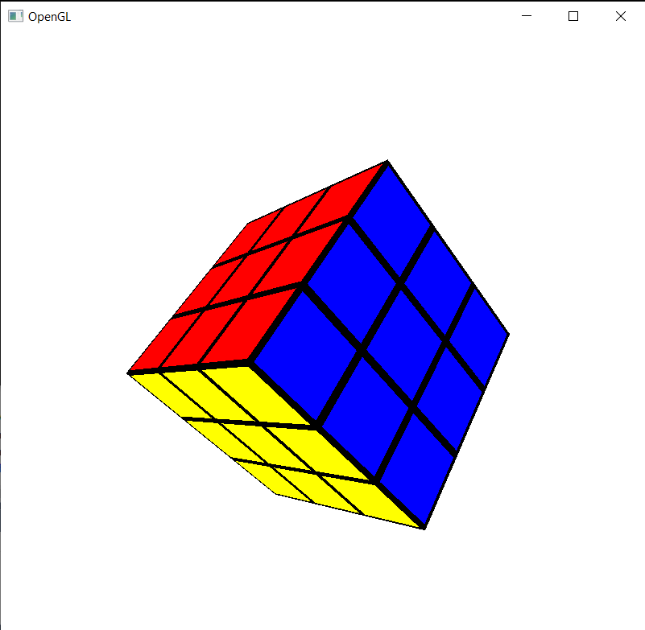
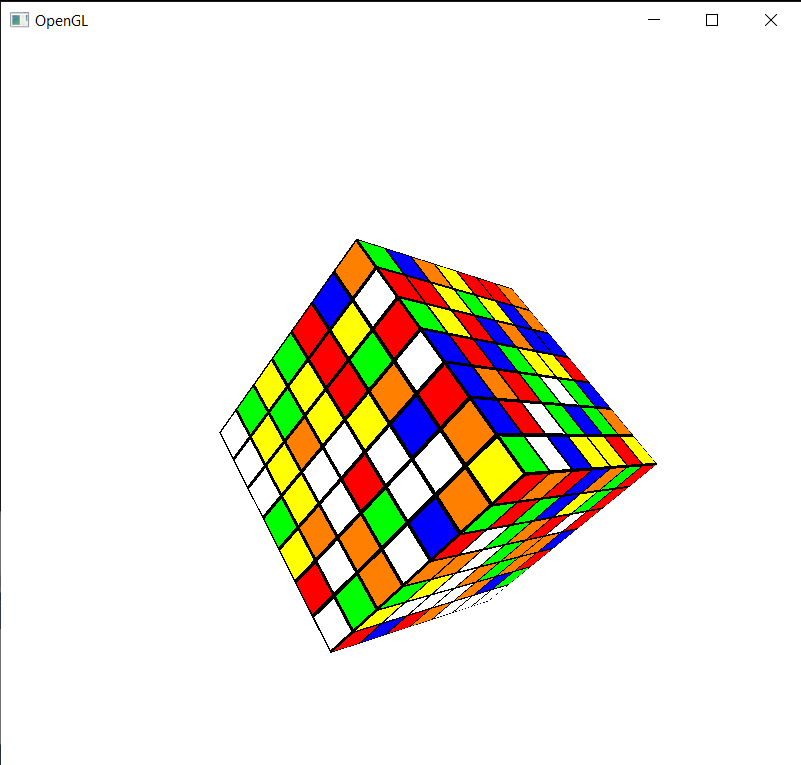
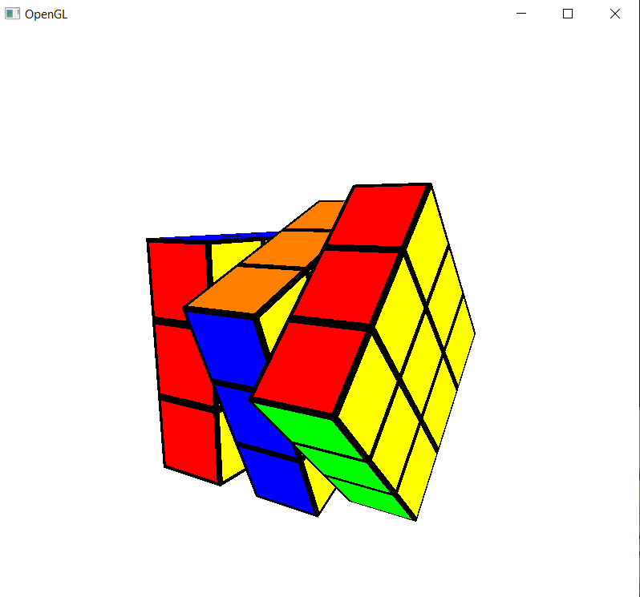

# Rubik's Cube:
Rubik's cube with OpenGL written in C++.

Render a rubik's cube while enabling rotation of the different faces.

## Project structure:

### engine
*This is the under-the-hood part that enables rendering meshes.*
- mesh.cpp
  - *Mesh represention via openGL.*
- shader.cpp
  - *Shader manager.*
- obj_lodaer.cpp
  - *.obj File parser.*

### RubiksCube
*The actual RubiksCube implementation.*
- main.cpp
  - *Entry point.*
- RubiksCube.cpp
  - *RubiksCube manager.*
- Cube.cpp 
  - *Cube represention.*
- SceneData.cpp 
  - *Scene represention.*
- InputHandler.cpp
  - *User input handler.*
- display.cpp
  - *glfw Window wrapper.*

##  Usage:
### Keyboards controls:

**Esc** - Exit the program.

**'R'** - Right face rotation.

**'L'** - Left face rotation.

**'U'** - Up face rotation.

**'D'** - Down face rotation.

**'B'** - Back face rotation.

**'F'** - Front face rotation.

**'Z'** - Divide rotation angle by 2.

**'A'** - Multiply rotation angle by 2, maximum of 180 degrees.

**'M'** - Mix the cube randomly.

**Q, W, E, T, Y, I**  - For atleast 4x4 cube.	

**O, G, P** - For 5x5 cube.

**'''** - Flip rotation direction from clockwise to counter clockwise or vise versa.

**Use arrows to rotate the whole rubik's cube around.**

##  Images:

